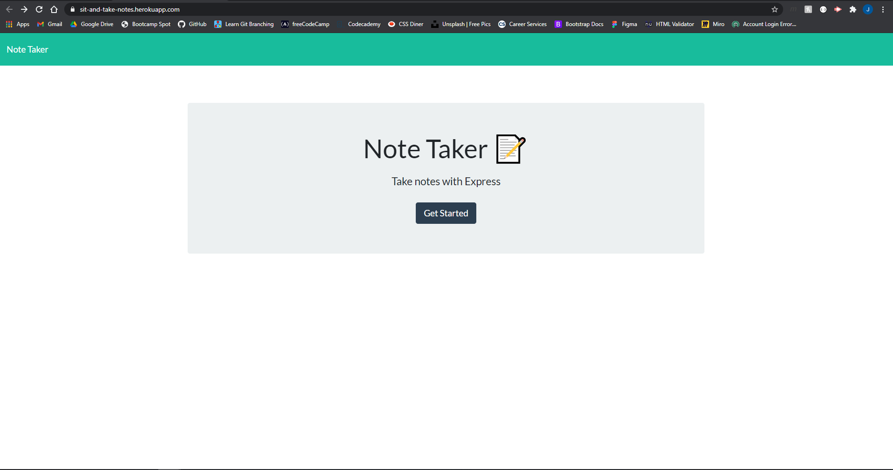
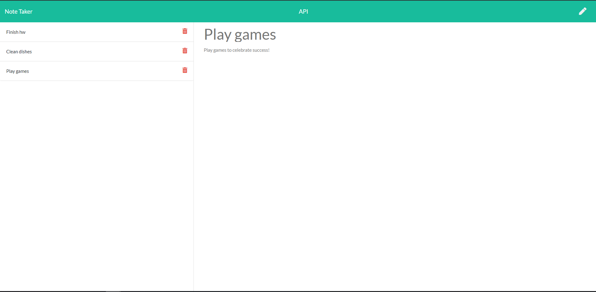
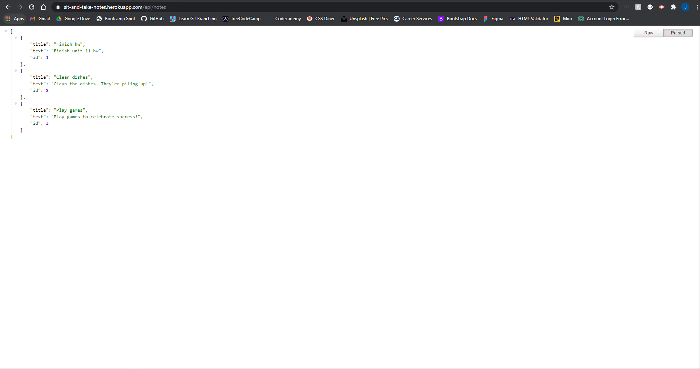

# SitAndTakeNotes
An application that uses both front end and back end application to be deployed to Heroku.

## Link to Demonstration 

https://sit-and-take-notes.herokuapp.com/

## Project Description

The purpose of this project is to take starter code and make a functional application that uses front and back end technologies. The back end technology to be used for this project is Express.js, in which a server will be ran by using Node.js. An API will be created to store JSON data for retrieval on the server-side.
## What to Expect From the Application

The user will be provided a web application where they can input information to be stored and rendered. Particularly, the user will be able to take notes and save their agenda for viewing at a later time.

This application will be deployed on Heroku, and will be polished and responsive.

## Technologies

* Javascript
* Node.js
* Express.js
## Tasks to Complete the Job :white_check_mark:

- [x] When the user opens the Note Taker App, they will be presented the homepage
- [x] When the user clicks on the "Get Started" button, they are taken to the notes page
- [x] When the user goes to the notes page, existing notes will show on the side. If no notes exist, there will be a placeholder showing "No saved notes"
- [x] When the user enters a note title and note text, a save button will appear in the navbar
- [x] When the user clicks on a saved note, the notes contents are displayed on the right-hand side
- [x] When the user clicks the write icon in the navbar, the right-hand fields will empty allowing for new notes

## Screenshots

